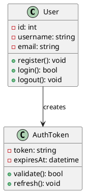
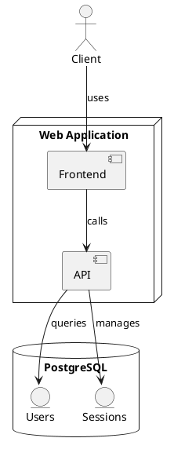
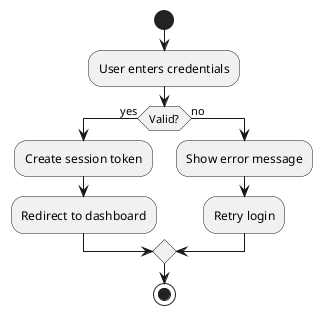
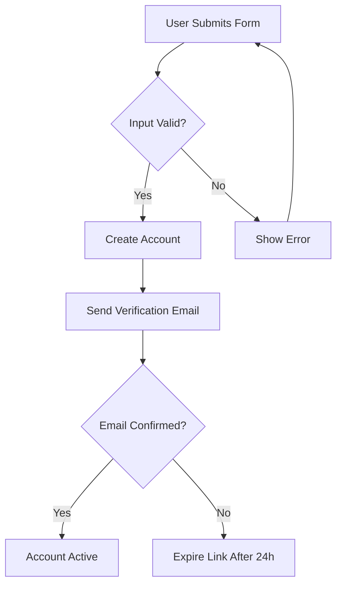
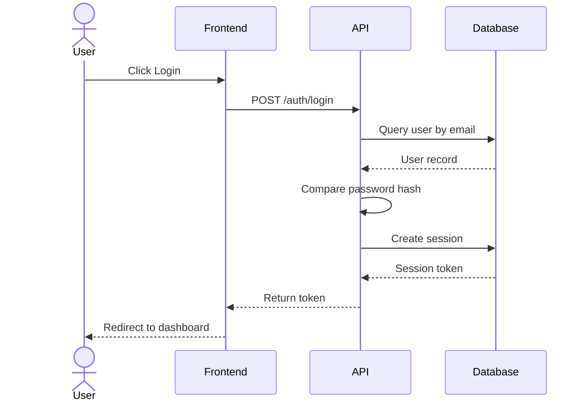
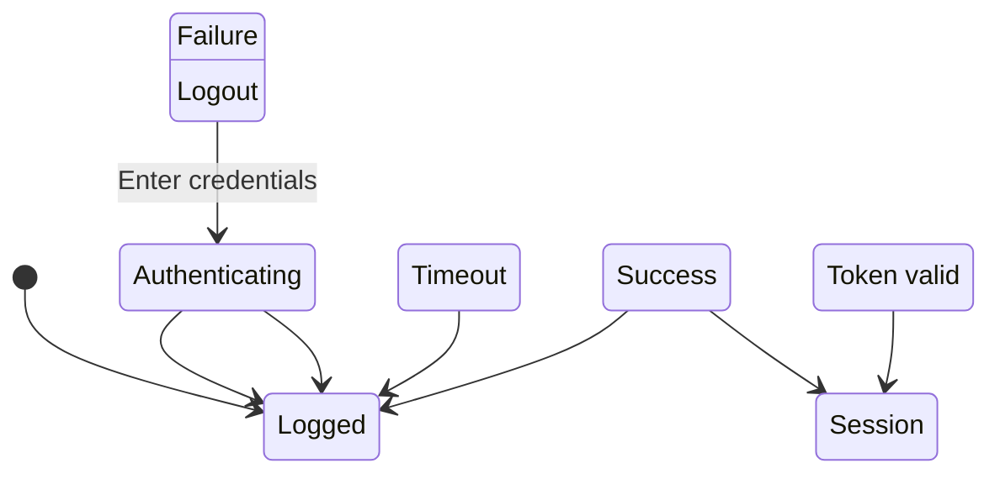
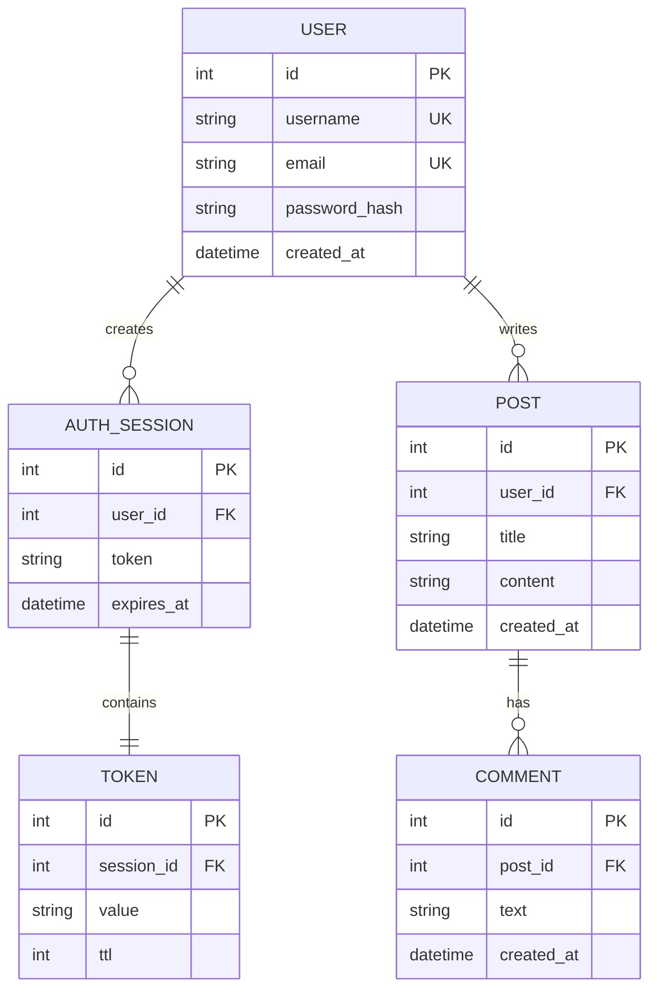

# Diagram Examples for Code-to-Doc

## PlantUML Examples

### Class Diagram


### Deployment Diagram


### Activity Diagram


## Mermaid Examples

### Flowchart


### Sequence Diagram


### State Diagram


### Entity Relationship Diagram


### Gantt Chart (Timeline)
```mermaid
gantt
    title Project Timeline
    dateFormat YYYY-MM-DD
    
    section Planning
    Requirements Gathering :des1, 2024-01-01, 30d
    Design Review :des2, after des1, 20d
    
    section Development
    Backend API :dev1, 2024-02-01, 45d
    Frontend :dev2, 2024-02-15, 50d
    Integration Testing :dev3, after dev1, dev2, 15d
    
    section Deployment
    Staging :deploy1, after dev3, 10d
    Production :deploy2, after deploy1, 5d
```

## How to Use in LaTeX

### Embedding PlantUML as SVG
```latex
\begin{figure}[h]
  \centering
  \includegraphics[width=0.8\textwidth]{diagrams/generated/architecture.svg}
  \caption{System Architecture}
  \label{fig:architecture}
\end{figure}
```

### Embedding Mermaid as PNG
```latex
\begin{figure}[h]
  \centering
  \includegraphics[width=0.8\textwidth]{diagrams/generated/user-flow.png}
  \caption{User Authentication Flow}
  \label{fig:user-flow}
\end{figure}
```

### Cross-referencing
```latex
As shown in Figure \ref{fig:architecture}, the system consists of three layers...
```

## Tools for Conversion

### PlantUML to SVG/PNG
```bash
plantuml -tsvg diagrams/architecture.puml -o diagrams/generated/
plantuml -tpng diagrams/architecture.puml -o diagrams/generated/
```

### Mermaid to SVG/PNG (using mmdc)
```bash
mmdc -i diagrams/flowchart.mmd -o diagrams/generated/flowchart.svg
mmdc -i diagrams/sequence.mmd -o diagrams/generated/sequence.png
```

### Building LaTeX
```bash
pdflatex -interaction=nonstopmode -output-directory=docs/build docs/main.tex
# May need to run twice for TOC to update
pdflatex -interaction=nonstopmode -output-directory=docs/build docs/main.tex
```

## Best Practices

1. **Keep diagrams simple** — Complex diagrams should be broken into smaller ones
2. **Label everything** — Clear labels and legends improve understanding
3. **Use consistent styling** — Match color schemes and fonts with LaTeX theme
4. **Version your diagrams** — Commit .puml and .mmd files, not just generated images
5. **Layer information** — Provide detail-progressive diagrams (high-level first, then zoomed-in)
6. **Student-friendly** — Add brief explanations under each diagram
